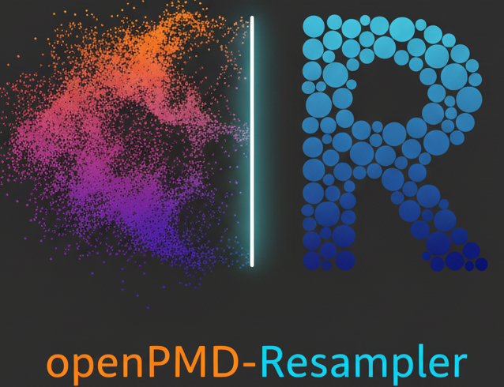

# :electron: openPMD-Resampler
Resampling tools for `openPMD` PIC data

## :bulb: Motivation

We often need to post-process the particle data from a PIC simulation, and pass it to additional tracking codes like [`GEANT`](#atom_symbol-geant4), [`GPT`](https://www.pulsar.nl/gpt/), [`SIMION`](https://simion.com) or [`Wake-T`](https://github.com/AngelFP/Wake-T). The original dataset can correspond to several **billion** particles, so one needs to reduce it to a manageable size, while conserving the main features of the underlying physics. This repository implements several resampling methods from the literature [[2]](#books-references), as well as a comprehensive suite of high-resolution [visualization](./plots/phase_space.png) tools, based on [Datashader](https://datashader.org).

## :rocket: Installation

We make use of the excellent [pixi](pixi.sh) package manager, which can be installed on Linux/macOS via

```console
$ curl -fsSL https://pixi.sh/install.sh | bash
```

One can then clone this repo via 

```console
$ git clone git@github.com:berceanu/openPMD-resampler.git
```

## :book: Usage

For an overview of the main functionality, see the [`usage.py`](./usage.py) example script and its [output](./output.md).
For production runs, use

```console
$ cd openPMD-resampler
$ pixi run start --opmd_path <path_to_your_openPMD_file> --species <particle_species_name> --mass <particle mass> --reduction_factor <k>
```

Replace descriptions between chevrons `<>` by relevant values, in this case the
path to the PIC output file, name of the particle species (`e_all` or
`e_highGamma` etc.), particle mass relative to the electron mass (default: 1.0) (1.0 for electron, 1836.152 for proton, or 22033.824 for carbon etc.), and an integer reduction factor `k`, typically between 2 and ~100.
If the initial PIC file has `N` macroparticles, the resulting reduced file will have `N/k`
macroparticles.

### Resampling algorithms

The resampling algorithm is selected via `--algorithm` (or `-a`):

- `thinning` (default): global leveling thinning [[2]](#books-references), controlled by `--reduction_factor`.
- `vranic`: particle merging of Vranic *et al.* [[4]](#books-references). Particles are binned into
  spatial and momentum cells, and each group of at least 4 particles sharing a cell is replaced by
  two macroparticles which exactly conserve total weight, momentum and energy.
- `voronoi`: Voronoi particle merging of Luu, Tückmantel and Pukhov [[5]](#books-references), as
  implemented in the [particle merger plugin](https://picongpu.readthedocs.io/en/0.5.0/usage/plugins/particleMerger.html)
  of PIConGPU. Particles are grouped into spatial cells which are subdivided recursively, first in
  position and then in momentum space, until the spread of every cluster falls below the given
  thresholds; each remaining cluster is replaced by a single macroparticle which exactly conserves
  total weight and momentum, with an energy error bounded by the momentum spread threshold.

For example:

```console
$ pixi run start --opmd_path <path_to_your_openPMD_file> --species <particle_species_name> --mass <particle mass> --algorithm vranic --spatial_bins 16 16 16 --momentum_bins 16 16 16
```

The Vranic merging accepts the following options:

| Option | Default | Description |
| --- | --- | --- |
| `--spatial_bins NX NY NZ` | `16 16 16` | Number of position bins along x, y, z. |
| `--momentum_bins NP NTHETA NPHI` | `16 16 16` | Number of momentum bins. |
| `--momentum_coordinates {spherical,cartesian}` | `spherical` | Momentum space coordinates used for the binning; with `cartesian`, the bins are `NPX NPY NPZ`. |
| `--log_scale` | off | Bin the momentum norm logarithmically (spherical only), useful for broad energy spectra. |
| `--device D` | auto | PyTorch device the merge runs on, e.g. `cuda`, `cuda:1` or `cpu`. By default the GPU is used when one is available (NVIDIA CUDA and AMD ROCm builds of PyTorch both expose it as `cuda`), the CPU otherwise. |

The Voronoi merging accepts the following options, mirroring the PIConGPU plugin:

| Option | Default | Description |
| --- | --- | --- |
| `--spatial_bins NX NY NZ` | `16 16 16` | Number of initial Voronoi cells along x, y, z. |
| `--min_particles_to_merge N` | `8` | Minimum number of macroparticles in a Voronoi cell needed to merge them into a single macroparticle. |
| `--pos_spread_threshold T` | `0.5` | Below this spread in position a cell can be merged, in units of the initial spatial cell edge length. |
| `--abs_mom_spread_threshold T` | `-1` (disabled) | Below this absolute spread in momentum a cell can be merged, in units of $m_e c$. |
| `--rel_mom_spread_threshold T` | `-1` (disabled) | Below this spread in momentum relative to the cell's mean momentum a cell can be merged. Exactly one of the two momentum thresholds must be enabled. |
| `--min_mean_energy E` | `511.0` | Minimum mean kinetic energy in keV of a Voronoi cell needed to merge it (`0` disables the criterion). |
| `--device D` | auto | Same as for the Vranic merging. |

For example:

```console
$ pixi run start --opmd_path <path_to_your_openPMD_file> --species <particle_species_name> --mass <particle mass> --algorithm voronoi --rel_mom_spread_threshold 0.1 --spatial_bins 128 128 1024 --min_particles_to_merge 10
```

Unlike thinning, the merging algorithms do not set the reduction factor directly: coarser binning
(fewer bins) or larger spread thresholds merge more aggressively, at the cost of more phase-space
smearing, while finer settings preserve the distribution better but merge less. Since the merged
macroparticles have non-uniform weights, the `weights` column of the output file must be taken into
account by the tracking code. For photons, use `--mass 0.0`.

Both merging algorithms run on PyTorch, on the GPU when one is available. Spatial cells never
interact, so datasets larger than the GPU memory are automatically processed in chunks of whole
cells sized to the free GPU memory, without changing the result.

If you need a sample PIC output file for testing, you can download [lwfa.h5](https://transfer.sequanium.de/qjhu1I2t56/lwfa.h5) [212M].

The code works with `openPMD`-compatible PIC codes, such as [`WarpX`](https://github.com/ECP-WarpX/WarpX), [`PIConGPU`](https://github.com/ComputationalRadiationPhysics/picongpu), [`fbpic`](https://github.com/fbpic/fbpic), etc.

The runtime is typically a few minutes and the memory footprint is about twice the size of the input file.

The output is a CSV text file, of the following form:

```
position_x_um (μm), position_y_um (μm), position_z_um (μm), momentum_x_mev_c (MeV/c), momentum_y_mev_c (MeV/c), momentum_z_mev_c (MeV/c)
1.1201412540356980e+01,8.0062201241442832e-01,3.9551004545608885e+03,-9.1752357482910156e+00,-1.4616233825683594e+01,2.9899465942382812e+02
...
```

With `--fortran_binary`, the output is instead a Fortran unformatted (sequential, record-based) binary file with the records `n (int32), x, y, z, ux, uy, uz, w (float32 arrays)`, where the momenta are written as normalized momentum u = p/(m·c) (dimensionless, openPMD-viewer's `ux` convention) rather than MeV/c.

## :wrench: Development

All project dependencies are listed under [`pixi.toml`](pixi.toml).
Just create a fork, follow the install instructions and start making PRs.

## :atom_symbol: GEANT4

For a computational estimate, here is a quote from Ref. [1]:

> The computer system for [`GEANT4`](https://geant4.web.cern.ch) simulation is made up of Intel Quad-core 2.66 GHz CPU and 12 GB DDR3 RAM and OS is Ubuntu 9.04 server version. It took about 3~4 hours to simulate with $10^7$ primary particles.


## :books: References

[1] Park, Seong Hee, et al. "A simulation for the optimization of bremsstrahlung radiation for nuclear applications using laser accelerated electron beam." Proceedings of FEL2010, Malmö, 2010. [PDF](https://accelconf.web.cern.ch/FEL2010/papers/thpb13.pdf)

[2] Muraviev, A. et al. "Strategies for particle resampling in PIC simulations." Comput. Phys. Commun. 262, 107826 (2021). [DOI](https://doi.org/10.1016/j.cpc.2021.107826)

[3] Shimazaki, Hideaki, and Shigeru Shinomoto. "A method for selecting the bin size of a time histogram." Neural computation 19.6, 1503 (2007). [DOI](https://doi.org/10.1162/neco.2007.19.6.1503)

[4] Vranic, Marija, et al. "Merging of macro-particles in particle-in-cell simulations." Comput. Phys. Commun. 191, 65 (2015). [DOI](https://doi.org/10.1016/j.cpc.2015.01.020)

[5] Luu, Phuc T., Tückmantel, T. and Pukhov, A. "Voronoi particle merging algorithm for PIC codes." Comput. Phys. Commun. 202, 165 (2016). [DOI](https://doi.org/10.1016/j.cpc.2016.01.009)

## :loudspeaker: Acknowledgements

We would like to acknowledge useful discussions with [Richard Pausch (HZDR)](https://github.com/PrometheusPi).

## :link: Similar Projects

- [Particle Reduction](https://github.com/ComputationalRadiationPhysics/particle_reduction)
- [Hi-Chi framework](https://github.com/hi-chi/pyHiChi)
